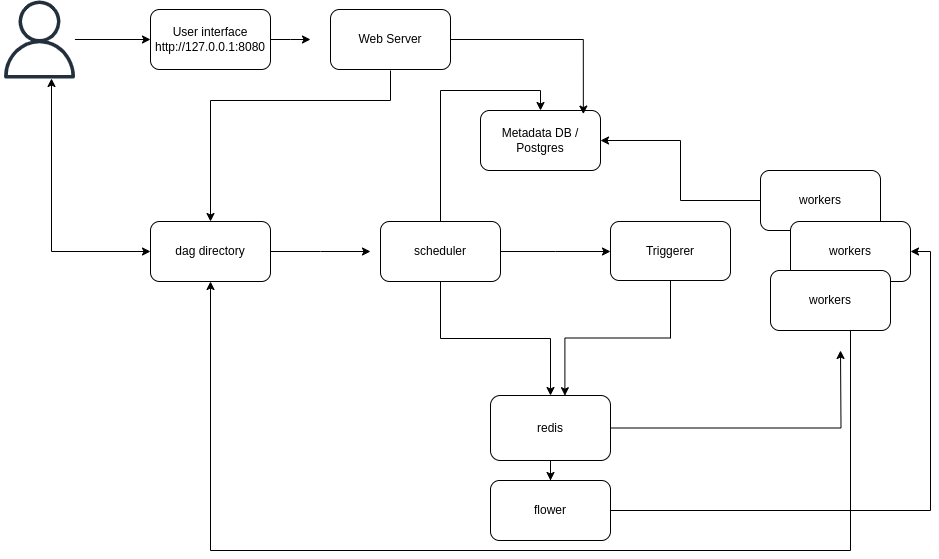
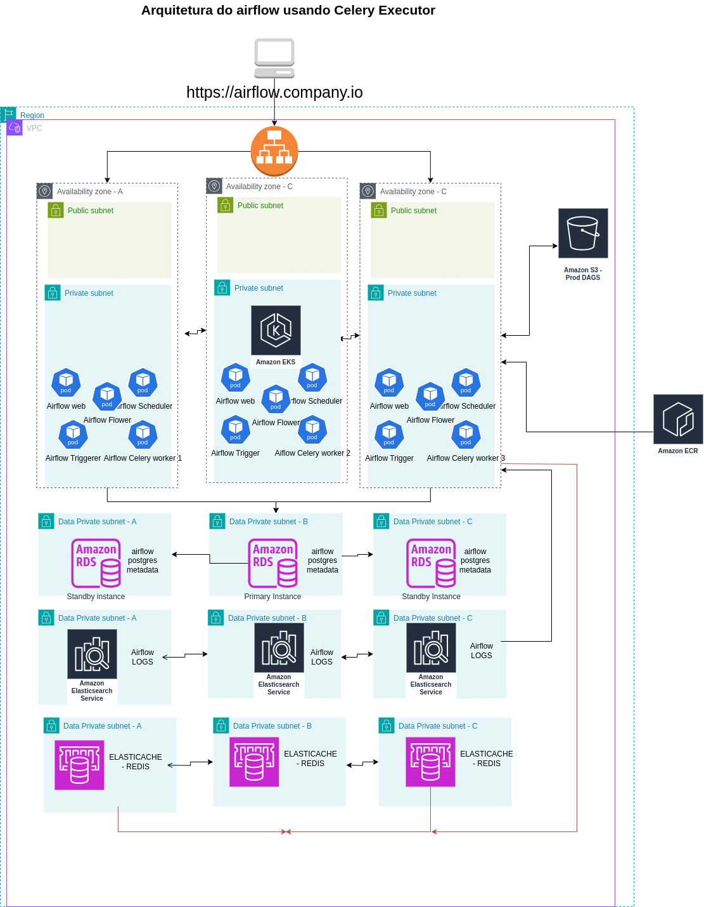
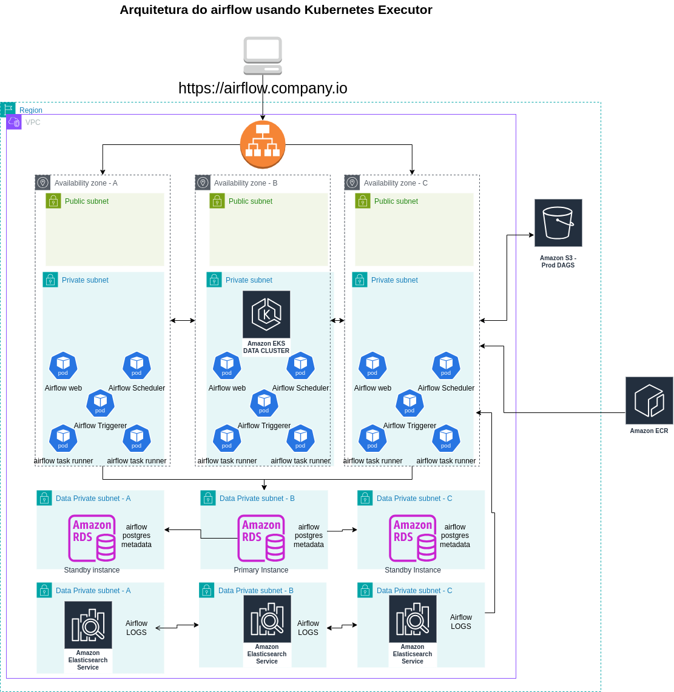

# Projeto de Configuração do Apache Airflow com Docker Compose

## Descrição do Projeto

Este projeto utiliza Docker Compose para iniciar e configurar um ambiente completo do Apache Airflow, que é uma plataforma de orquestração de workflows. O projeto inclui os seguintes serviços:

- **Postgres**: Banco de dados utilizado pelo Airflow para armazenar metadados.
- **Redis**: Utilizado como backend de mensagens para o Celery Executor.
- **Airflow Webserver**: Interface web do Airflow.
- **Airflow Scheduler**: Responsável por agendar e monitorar as DAGs.
- **Airflow Worker**: Executa as tarefas das DAGs utilizando o Celery Executor.
- **Airflow Triggerer**: Responsável por acionar tarefas baseadas em eventos.
- **Airflow Init**: Serviço de inicialização para configurar o ambiente do Airflow.
- **Airflow CLI**: Interface de linha de comando do Airflow para depuração.
- **Flower**: Interface web para monitorar o Celery.


## Demonstração

https://drive.google.com/file/d/1hmrExxhGX0gOBQnJLaVFF2pi4UqTkATu/view

## Como Usar

1. **Pré-requisitos**: Certifique-se de ter o Docker e o Docker Compose instalados.
2. **Instalação**: Clone este repositório
3. **Configurando o usuário correto do Airflow**: 
   No Linux, o início rápido precisa saber o ID do usuário do host e precisa ter o ID do grupo definido como 0. Caso contrário, os arquivos criados em `dags`, `logs` e `plugins` serão criados com a propriedade do usuário `root`. Você precisa certificar-se de configurá-los para o `docker-compose`:
   ```bash
   mkdir -p ./dags ./logs ./plugins ./config
   echo -e "AIRFLOW_UID=$(id -u)" > .env
   ```
4. **executando o docker-compose**:
   ```bash
   docker-compose up
   ```
5. **Acesso**: Acesse a interface do Airflow em `http://localhost:8080` com as credenciais padrão configuradas no docker-compose.


## Diagrama dos Componentes do Airflow



## Proposta de Arquitetura para Rodar Airflow na Nuvem

Foram criadas duas propostas para rodar o Airflow na nuvem, pensando em um ambiente produtivo com alta disponibilidade. A primeira proposta utiliza o Celery Executor e a segunda utiliza o Kubernetes Executor.

### Celery Executor



Nessa arquitetura usamos os seguintes componentes:

- Uma VPC
- Um Application Load Balancer
- Três subnets públicas
- Três subnets privadas para aplicação
- Três subnets privadas para serviços de dados
- Bucket S3 para armazenar as DAGs, com um serviço altamente disponível
- Amazon ECR para fazer o pull das imagens Docker
- Elasticache Redis com alta disponibilidade para o Celery e componentes (Flower, Workers, etc.)
- RDS Postgres com alta disponibilidade para os metadados dos componentes do Airflow
- Elasticsearch com alta disponibilidade para armazenamento dos logs do Airflow

#### Detalhes

Ao acessar o `airflow.company.io`, a requisição é realizada para o Application Load Balancer, que encaminha a requisição para o Ingress no Kubernetes, que por sua vez encaminha para o Service da aplicação (pod web service).

No Kubernetes, existem 3 zonas de disponibilidade configuradas para garantir que os componentes do Airflow fiquem disponíveis.

Cada zona de disponibilidade possui uma réplica do Webserver, Scheduler, Worker, etc., para garantir que, caso uma zona de disponibilidade fique indisponível, ainda seja possível ter o Airflow funcional.

As dependências do Airflow também possuem alta disponibilidade. Os metadados estão usando RDS em Multi-AZ, o Redis para o Celery também está em Multi-AZ e o Elasticsearch para armazenar os logs também está em Multi-AZ.

As imagens Docker estão armazenadas no ECR para não depender de registries externos ou com limite de download.

#### Vantagens e Desvantagens do Celery Executor

**Vantagens:**
- **Escalabilidade Horizontal**: Pode escalar horizontalmente, adicionando mais workers ao cluster.
- **Persistência de Estado**: O Celery Executor mantém o estado das tarefas em um banco de dados (normalmente um banco de dados backend, como PostgreSQL ou MySQL), o que facilita a recuperação de falhas.
- **Resiliência**: Pode ser configurado para reter tarefas em caso de falha do worker, permitindo que elas sejam redistribuídas para outros workers.

**Desvantagens:**
- **Gerenciamento de Workers**: Embora seja escalável, o gerenciamento de workers pode se tornar complexo à medida que a infraestrutura cresce, especialmente se você tiver muitos workers distribuídos.
- **Dependência de Message Broker**: O Celery depende de um sistema de mensageria, como RabbitMQ ou Redis, para transmitir as tarefas. Isso adiciona uma camada extra de complexidade e pode se tornar um ponto de falha.
- **Overhead de Rede**: A comunicação entre workers e o scheduler via message broker pode introduzir latência, principalmente em ambientes grandes ou quando a rede não é otimizada.
- **Complexidade na Escalabilidade**: Embora o Celery possa escalar horizontalmente, a escalabilidade pode ser limitada devido à sobrecarga do sistema de mensagens e ao gerenciamento de workers.

### Kubernetes Executor



Nessa arquitetura usamos os seguintes componentes:

- Uma VPC
- Um Application Load Balancer
- Três subnets públicas
- Três subnets privadas para aplicação
- Três subnets privadas para serviços de dados
- Bucket S3 para armazenar as DAGs, com um serviço altamente disponível
- Amazon ECR para fazer o pull das imagens Docker
- RDS Postgres com alta disponibilidade para os metadados dos componentes do Airflow
- Elasticsearch com alta disponibilidade para armazenamento dos logs do Airflow

#### Detalhes

Ao acessar o `airflow.company.io`, a requisição é realizada para o Application Load Balancer, que encaminha a requisição para o Ingress no Kubernetes, que por sua vez encaminha para o Service da aplicação (pod web service).

No Kubernetes, existem 3 zonas de disponibilidade configuradas para garantir que os componentes do Airflow fiquem disponíveis.

Cada zona de disponibilidade possui uma réplica do Webserver, Scheduler, Worker, etc., para garantir que, caso uma zona de disponibilidade fique indisponível, ainda seja possível ter o Airflow funcional.

As dependências do Airflow também possuem alta disponibilidade. Os metadados estão usando RDS em Multi-AZ, o Redis para o Celery também está em Multi-AZ e o Elasticsearch para armazenar os logs também está em Multi-AZ.

As imagens Docker estão armazenadas no ECR para não depender de registries externos ou com limite de download.

#### Vantagens e Desvantagens do Kubernetes Executor

**Vantagens:**
- **Escalabilidade Automática e Dinâmica**: O Kubernetes Executor pode criar novos pods dinamicamente conforme necessário, sem necessidade de gerenciar workers manualmente. O Kubernetes gerencia a alocação de recursos automaticamente.
- **Isolamento**: Cada tarefa pode ser executada em seu próprio pod, proporcionando um alto nível de isolamento. Isso é particularmente útil quando se deseja garantir que tarefas diferentes não interfiram entre si.
- **Gerenciamento de Recursos**: O Kubernetes oferece controle granular sobre recursos, como CPU e memória, o que pode ser útil para alocar recursos específicos para cada tarefa.
- **Facilidade de Integração com Kubernetes**: Se a infraestrutura já usa Kubernetes, o Kubernetes Executor é uma escolha natural, aproveitando recursos como escalabilidade automática e gerenciamento de pods.

**Desvantagens:**
- **Sobrecarga de Inicialização de Pods**: Criar e destruir pods para cada tarefa pode introduzir overhead, especialmente em tarefas de curta duração. Isso pode aumentar o tempo de execução das tarefas.
- **Gerenciamento de Configuração**: Configurar o Kubernetes Executor pode ser mais complexo, pois exige o conhecimento adequado de como funciona o Kubernetes, além da configuração do Airflow para integrá-lo corretamente.
- **Custo de Recursos**: A criação de pods pode resultar em custos adicionais de recursos, especialmente se muitas tarefas forem executadas simultaneamente e os pods forem mantidos por longos períodos.
- **Dependência de Kubernetes**: A implementação e operação dependem de uma infraestrutura Kubernetes funcional. Se você não tem Kubernetes configurado, o custo de implementação e manutenção pode ser alto.

## Contribuição

Se você deseja contribuir para este projeto, sinta-se à vontade para abrir um pull request ou relatar problemas.

## Licença

Este projeto está licenciado sob a MIT License. Veja o arquivo LICENSE para mais detalhes.
